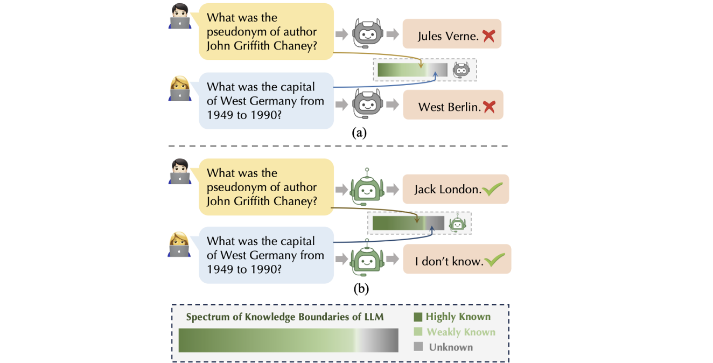
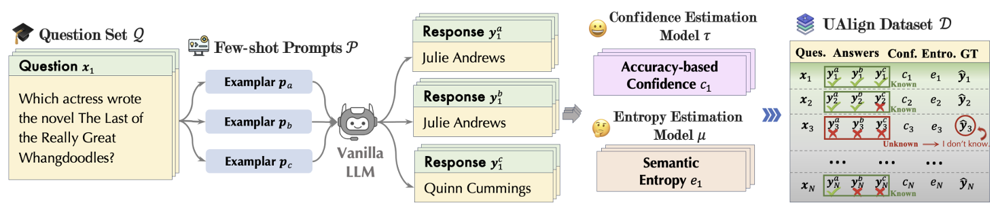
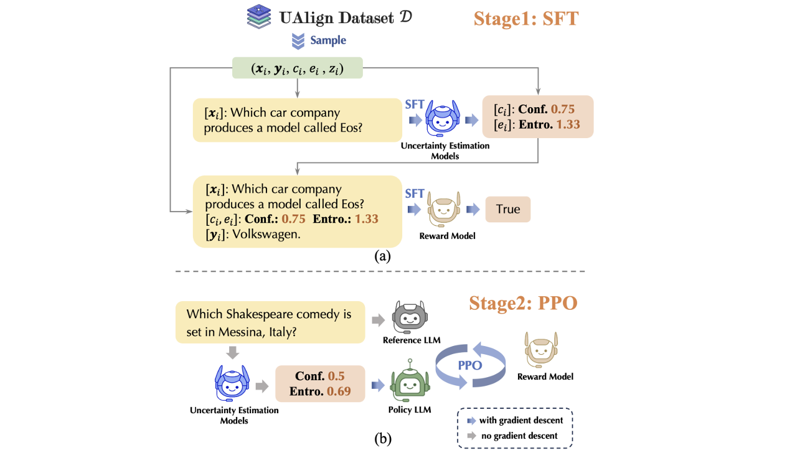

# UAlign: Leveraging Uncertainty Estimations for Factuality Alignment on Large Language Models

## Introduction

This is the repository for the UAlign framework, which leverages Uncertainty estimations to represent knowledge boundaries, and then explicitly incorporates these representations as input features into prompts for LLMs to Align with factual knowledge as examplified in 



The project includes two stages: 1)dataset construction; and 2) alignment. The completely management of this project is in progress.

---

## Implementation

### Stage 1: Data construction: Dataset Sampling and Construction



```shell

CUDA_VISIBLE_DEVICES=0,1,2,3 python code/sample.py --model_name llama3 --dataset sciq --data_file validation
python code/uncertainty.py --model_name llama3 --dataset triviaqa --data_file train

```

### Stage 2: LLM Training (SFT, PPO, DPO)



```shell
CUDA_VISIBLE_DEVICES=0,1,2,3 python code/train_sft.py --model_name mistral --dataset comb --data_file train_sft --save_suffix base
CUDA_VISIBLE_DEVICES=0,1,2,3 python code/train_ppo.py --model_name mistral --dataset comb --data_file train_ppo --save_suffix base
CUDA_VISIBLE_DEVICES=0,1,2,3 python code/train_dpo.py --model_name mistral --dataset comb --data_file train_dpo --save_suffix base
```

### Stage 3: LLM decoding and inference 

```shell
python code/infer.py --model_name $model --dataset $dataset --data_file validation --max_length 16 --lora_use true --model_suffix sft_base
```


### Stage 4: Evaluate the generations

```shell
python code/eval.py --model_name $model --dataset $dataset --data_file validation --model_suffix vanilla_$icl_type
```

## Citation

If you need to refer to [this paper](https://arxiv.org/abs/2412.11803), please cite with the bibtex listed blow:
```bibtext
@misc{xue2024ualignleveraginguncertaintyestimations,
      title={UAlign: Leveraging Uncertainty Estimations for Factuality Alignment on Large Language Models}, 
      author={Boyang Xue and Fei Mi and Qi Zhu and Hongru Wang and Rui Wang and Sheng Wang and Erxin Yu and Xuming Hu and Kam-Fai Wong},
      year={2024},
      eprint={2412.11803},
      archivePrefix={arXiv},
      primaryClass={cs.CL},
      url={https://arxiv.org/abs/2412.11803}, 
}
